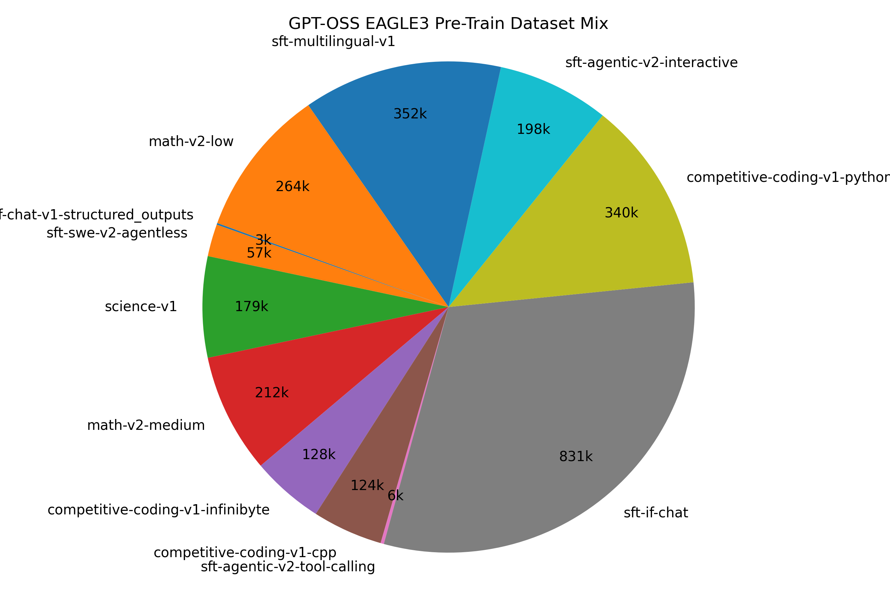

# Overview

This is the plan for training data for EAGLE3 GPT-OSS (Round 5).
Author: Benjamin Chislett

## Coverage

Key categories that must be represented in the training data are:
- Math
- Coding
- Science
- Tool-Calling
- Structured Outputs
- Agentic (Assistant / SWE)
- Instruction Following
- Chat
- Creative Writing
- Multilingual

## Scale

At the current speed, I can process 1.75 Million training samples of length 4096 tokens in 8 hours on 8xB200 (3 TTT steps). So for a single-day training run, we land somewhere between 10B and 20B tokens.

## Multi-Phase

For this project we will use two distinct training phases.

The first phase ("Pretrain/SFT") will run the majority of the training tokens. It will use a shorter max sequence length (4096), use a fewer number of TTT steps (3), and will not involve synthetically regenerated responses.
Budget for phase 1 is roughly 2 million samples.

In addition, the first phase will be downsampled 20-to-1 to a 100k-sample representative dataset that will be used for hyperparameter sweeps. Then the selected hyperparameters will be used for the large-scale run on the first phase.

The second phase ("SFT/RL") will use a smaller dataset with a longer max training length (as large as will fit on the device). Samples used for this phase will employ synthetic data generation. The second phase may use tuned loss functions beyond KL-divergence, such as [LK Losses](https://arxiv.org/pdf/2602.23881).

### Pre-Train/SFT Datasets

See the [Notebook](PretrainData.ipynb) for exact preparation.

- **nvidia/Nemotron-SFT-SWE-v2**
- - Agentless split (210k samples) is good, no preprocessing needed. Some long samples, 150k under 8k and 57k under 4k
- - Openhands SWE split (~50k samples) has no reasoning content. Potentially suitable for RL split. Will not use.
- **nvidia/Nemotron-SFT-Agentic-v2**
- - interactive_agent (279k samples) is good, some samples don't have reasoning in the final step. Drop those to get down to 214k total, 198k under 4k seqlen
- - Search samples are way too long, mostly 20k+ seqlen. Potentially suitable for RL split. Will not use.
- - tool_calling (8.4k samples) is good, same preprocessing as interactive_agent. Goes down to 6.5k filtered, 5.8k under 4k seqlen
- **nvidia/Nemotron-Math-v2**
- - Low, Medium, and High modes with multiple rollouts for each problem. Filtering down to one rollout per reasoning level gives ~300k per category. High samples have too many tokens per sample, will omit for now. Medium and Low both have about 210k samples under 4k seqlen after filtering, will take them all. Naive FCFS filtering over the problems left only a few thousand tool-call examples for medium, and about 25k for low. This seems like a reasonable fraction anyways, so I'm leaving it in.
- **nvidia/Nemotron-Competitive-Programming-v1**
- - Most problems seem to be well over the 4k token limit. However, there is such a sheer volume of samples that we can still get a large selection just by sampling those with <4k tokens. Filtered to 124k CPP samples, 340k Python samples, 128k Infinibyte samples. Will probably keep them all.
- **nvidia/Nemotron-SFT-Instruction-Following-Chat-v2**
- Almost all reasoning-on samples are kept here when filtering to 4k seqlen. 831k samples. Keeping them all.
- **nvidia/Nemotron-Instruction-Following-Chat-v1**
- structured_outputs (5k samples) used exclusively from this dataset. Filtered down to ~3k samples.
- **nvidia/Nemotron-SFT-Multilingual-v1**
- Tons of samples here. Note the reasoning traces are all english, so we have to hope that this is in-distribution enough for how gpt-oss will handle it. Downsampling by 4x just to save on the templating cost, then selecting only the <4k seqlen samples. Comes out to 352k, keeping them all.
- **nvidia/Nemotron-Science-v1**
- - Combining RQA and MCQ sections into one training file. Most samples are fairly short, filtering to 4k comes out to 179k samples. Will use them all.

Category coverage breakdown:
- ✅ Math
- - eagle_training_data/pretrain/math-v2-low-4k.jsonl
- - eagle_training_data/pretrain/math-v2-medium-4k.jsonl
- ✅ Coding
- - eagle_training_data/pretrain/competitive-coding-v1-cpp-4k.jsonl
- - eagle_training_data/pretrain/competitive-coding-v1-python-4k.jsonl
- - eagle_training_data/pretrain/competitive-coding-v1-infinibyte-4k.jsonl
- ✅ Science
- - eagle_training_data/pretrain/science-v1-4k.jsonl
- ✅ Tool-Calling
- - eagle_training_data/pretrain/sft-agentic-v2-tool-calling-4k.jsonl 
- ✅ Structured Outputs
- - eagle_training_data/pretrain/if-chat-v1-structured_outputs-4k.jsonl
- ✅ Agentic (Assistant / SWE)
- - eagle_training_data/pretrain/sft-agentic-v2-interactive-4k.jsonl
- - eagle_training_data/pretrain/sft-swe-v2-agentless-4k.jsonl
- ✅ Chat / Instruction Following
- - eagle_training_data/pretrain/sft-if-chat-4k.jsonl
- ✅ Multilingual
- - eagle_training_data/pretrain/sft-multilingual-v1-4k.jsonl

Total number of samples: 2697247

Issue: nvidia/Nemotron-Competitive-Programming-v1 samples are not valid. Will just have to hope there's enough coding in the rest

### Long-Context Datasets

Avoiding SDG for now. Sampling from datasets with a focus on the long-ctx ones. Target size is 200k samples.

- ✅ Math
✅ - - eagle_training_data/long_context/math-v2-low.jsonl (5k samples)
✅ - - eagle_training_data/long_context/math-v2-medium.jsonl (15k samples)
✅ - - eagle_training_data/long_context/math-v2-high.jsonl (15k samples)
- ✅ Coding
✅ - - eagle_training_data/long_context/competitive-coding-v1-cpp.jsonl (25k samples)
✅ - - eagle_training_data/long_context/competitive-coding-v1-python.jsonl (35k samples)
✅ - - eagle_training_data/long_context/competitive-coding-v1-infinibyte.jsonl (10k samples)
- ✅ Science
✅ - - eagle_training_data/long_context/science-v1.jsonl (10k samples)
- ✅ Tool-Calling
✅ - - eagle_training_data/long_context/sft-agentic-v2-tool-calling.jsonl (6k samples)
- ✅ Structured Outputs
✅ - - eagle_training_data/long_context/if-chat-v1-structured_outputs.jsonl (2k samples)
- ✅ Agentic (Assistant / SWE)
✅ - - eagle_training_data/long_context/sft-agentic-v2-interactive.jsonl (15k samples)
✅ - - eagle_training_data/long_context/sft-agentic-v2-search.jsonl (6k samples)
✅ - - eagle_training_data/long_context/sft-swe-v2-agentless.jsonl (20k samples)
- ✅ Chat / Instruction Following
✅ - - eagle_training_data/long_context/sft-if-chat.jsonl (15k samples)
- ✅ Multilingual
✅ - - eagle_training_data/long_context/sft-multilingual-v1.jsonl (10k samples)
